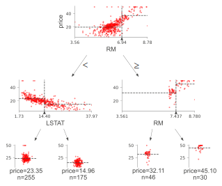

# dtreeviz : Decision Tree Visualization

## Description
A python library for decision tree visualization and model interpretation.  Currently supports [scikit-learn](https://scikit-learn.org/stable), [XGBoost](https://xgboost.readthedocs.io/en/latest), [Spark MLlib](https://spark.apache.org/mllib/), and [LightGBM](https://lightgbm.readthedocs.io/en/latest/) trees. With 1.3, we now provide one- and two-dimensional feature space illustrations for classifiers (any model that can answer `predict_probab()`); see [below](README.md#classification-boundaries-in-feature-space).

Authors:

* [Terence Parr](http://parrt.cs.usfca.edu), a professor in the [University of San Francisco's data science program](https://www.usfca.edu/arts-sciences/graduate-programs/data-science)
* [Tudor Lapusan](https://www.linkedin.com/in/tudor-lapusan-5902593b/)
* [Prince Grover](https://www.linkedin.com/in/groverpr)

See [How to visualize decision trees](http://explained.ai/decision-tree-viz/index.html) for deeper discussion of our decision tree visualization library and the visual design decisions we made. 

### Feedback

We welcome info from users on how they use dtreeviz, what features they'd like, etc... via [email (to parrt)](mailto:parrt@cs.usfca.edu) or via an [issue](https://github.com/parrt/dtreeviz/issues).

## Quick start

Jump right into the examples using this [Colab notebook](https://colab.research.google.com/github/parrt/dtreeviz/blob/master/notebooks/examples.ipynb)

Take a look in [notebooks](https://github.com/parrt/dtreeviz/tree/master/notebooks)! Here we have a specific notebook for all supported ML libraries and more.

## Discussion

Decision trees are the fundamental building block of [gradient boosting machines](http://explained.ai/gradient-boosting/index.html) and [Random Forests](https://en.wikipedia.org/wiki/Random_forest)(tm), probably the two most popular machine learning models for structured data.  Visualizing decision trees is a tremendous aid when learning how these models work and when interpreting models.  Unfortunately, current visualization packages are rudimentary and not immediately helpful to the novice. For example, we couldn't find a library that visualizes how decision nodes split up the feature space. It is also uncommon for libraries to support visualizing a specific feature vector as it weaves down through a tree's decision nodes; we could only find one image showing this.

So, we've created a general package for decision tree visualization and model interpretation, which we'll be using heavily in an upcoming [machine learning book](https://mlbook.explained.ai/) (written with [Jeremy Howard](http://www.fast.ai/about/#jeremy)).

The visualizations are inspired by an educational animation by [R2D3](http://www.r2d3.us/); [A visual introduction to machine learning](http://www.r2d3.us/visual-intro-to-machine-learning-part-1/). With `dtreeviz`, you can visualize how the feature space is split up at decision nodes, how the training samples get distributed in leaf nodes, how the tree makes predictions for a specific observation and more. These operations are critical to for  understanding how classification or regression decision trees work. If you're not familiar with decision trees, check out [fast.ai's Introduction to Machine Learning for Coders MOOC](https://course18.fast.ai/ml.html).

## Install

Install anaconda3 on your system, if not already done.

You might verify that you do not have conda-installed graphviz-related packages installed because dtreeviz needs the pip versions; you can remove them from conda space by doing:

```bash
conda uninstall python-graphviz
conda uninstall graphviz
```

To install (Python >=3.6 only), do this (from Anaconda Prompt on Windows!):

```bash
pip install dtreeviz             # install dtreeviz for sklearn
pip install dtreeviz[xgboost]    # install XGBoost related dependency
pip install dtreeviz[pyspark]    # install pyspark related dependency
pip install dtreeviz[lightgbm]   # install LightGBM related dependency
```

This should also pull in the `graphviz` Python library (>=0.9), which we are using for platform specific stuff.

**Limitations.** Only svg files can be generated at this time, which reduces dependencies and dramatically simplifies install process.

Please email [Terence](mailto:parrt@cs.usfca.edu) with any helpful notes on making dtreeviz work (better) on other platforms. Thanks! 

For your specific platform, please see the following subsections.

### Mac

Make sure to have the latest XCode installed and command-line tools installed. You can run `xcode-select --install` from the command-line to install those if XCode is already installed. You also have to sign the XCode license agreement, which you can do with `sudo xcodebuild -license` from command-line. The brew install shown next needs to build graphviz, so you need XCode set up properly.

You need the graphviz binary for `dot`. Make sure you have latest version (verified on 10.13, 10.14):

```bash
brew reinstall graphviz
```

Just to be sure, remove `dot` from any anaconda installation, for example:

```bash
rm ~/anaconda3/bin/dot
```

From command line, this command

```bash
dot -Tsvg
```

should work, in the sense that it just stares at you without giving an error. You can hit control-C to escape back to the shell.  Make sure that you are using the right `dot` as installed by brew:

```bash
$ which dot
/usr/local/bin/dot
$ ls -l $(which dot)
lrwxr-xr-x  1 parrt  wheel  33 May 26 11:04 /usr/local/bin/dot@ -> ../Cellar/graphviz/2.40.1/bin/dot
$
```

**Limitations.** Jupyter notebook has a bug where they do not show .svg files correctly, but Juypter Lab has no problem.

### Linux (Ubuntu 18.04)

To get the `dot` binary do:
 
```bash
sudo apt install graphviz
```

**Limitations.** The `view()` method works to pop up a new window and images appear inline for jupyter notebook but not jupyter lab (It gets an error parsing the SVG XML.)  The notebook images also have a font substitution from the Arial we use and so some text overlaps. Only .svg files can be generated on this platform.

### Windows 10

(Make sure to `pip install graphviz`, which is common to all platforms, and make sure to do this from Anaconda Prompt on Windows!)

[Download graphviz-2.38.msi](https://graphviz.gitlab.io/_pages/Download/Download_windows.html) and update your `Path` environment variable.  Add `C:\Program Files (x86)\Graphviz2.38\bin` to User path and `C:\Program Files (x86)\Graphviz2.38\bin\dot.exe` to System Path. It's windows so you might need a reboot after updating that environment variable.  You should see this from the Anaconda Prompt:

```
(base) C:\Users\Terence Parr>where dot
C:\Program Files (x86)\Graphviz2.38\bin\dot.exe
```

(Do not use `conda install -c conda-forge python-graphviz` as you get an old version of `graphviz` python library.)

Verify from the Anaconda Prompt that this works (capital `-V` not lowercase `-v`):

```
dot -V
```

If it doesn't work, you have a `Path` problem. I found the following test programs useful. The first one sees if Python can find `dot`:

```python
import os
import subprocess
proc = subprocess.Popen(['dot','-V'])
print( os.getenv('Path') )
```

The following version does the same thing except uses `graphviz` Python libraries backend support utilities, which is what we use in dtreeviz:

```python
import graphviz.backend as be
cmd = ["dot", "-V"]
stdout, stderr = be.run(cmd, capture_output=True, check=True, quiet=False)
print( stderr )
```

If you are having issues with run command you can try copying the following files from: https://github.com/xflr6/graphviz/tree/master/graphviz.

Place them in the AppData\Local\Continuum\anaconda3\Lib\site-packages\graphviz folder. 

Clean out the __pycache__ directory too.

Jupyter Lab and Jupyter notebook both show the inline .svg images well.

### Verify graphviz installation

Try making text file `t.dot` with content `digraph T { A -> B }` (paste that into a text editor, for example) and then running this from the command line:

```
dot -Tsvg -o t.svg t.dot
```

That should give a simple `t.svg` file that opens properly.  If you get errors from `dot`, it will not work from the dtreeviz python code.  If it can't find `dot` then you didn't update your `PATH` environment variable or there is some other install issue with `graphviz`.

### Limitations

Finally, don't use IE to view .svg files. Use Edge as they look much better. I suspect that IE is displaying them as a rasterized not vector images. Only .svg files can be generated on this platform.

## Usage

`dtree`: Main function to create decision tree visualization. Given a decision tree regressor or classifier, creates and returns a tree visualization using the graphviz (DOT) language.

### Required libraries

Basic libraries and imports that will (might) be needed to generate the sample visualizations shown in examples below. 
 
```bash
from sklearn.datasets import *
from sklearn import tree
from dtreeviz.trees import *
```

### Regression decision tree

The default orientation of tree is top down but you can change it to left to right using `orientation="LR"`. `view()` gives a pop up window with rendered graphviz object. 

```bash
regr = tree.DecisionTreeRegressor(max_depth=2)
boston = load_boston()
regr.fit(boston.data, boston.target)

viz = dtreeviz(regr,
               boston.data,
               boston.target,
               target_name='price',
               feature_names=boston.feature_names)
              
viz.view()              
```
  

  
  
### Classification decision tree

An additional argument of `class_names` giving a mapping of class value with class name is required for classification trees. 

```bash
classifier = tree.DecisionTreeClassifier(max_depth=2)  # limit depth of tree
iris = load_iris()
classifier.fit(iris.data, iris.target)

viz = dtreeviz(classifier, 
               iris.data, 
               iris.target,
               target_name='variety',
               feature_names=iris.feature_names, 
               class_names=["setosa", "versicolor", "virginica"]  # need class_names for classifier
              )  
              
viz.view() 
```


### Prediction path

Highlights the decision nodes in which the feature value of single observation passed in argument `X` falls. Gives feature values of the observation and highlights features which are used by tree to traverse path. 
  
```bash
regr = tree.DecisionTreeRegressor(max_depth=2)  # limit depth of tree
diabetes = load_diabetes()
regr.fit(diabetes.data, diabetes.target)
X = diabetes.data[np.random.randint(0, len(diabetes.data)),:]  # random sample from training

viz = dtreeviz(regr,
               diabetes.data, 
               diabetes.target, 
               target_name='value', 
               orientation ='LR',  # left-right orientation
               feature_names=diabetes.feature_names,
               X=X)  # need to give single observation for prediction
              
viz.view()  
```


If you want to visualize just the prediction path, you need to set parameter _show_just_path=True_

```bash
dtreeviz(regr,
        diabetes.data, 
        diabetes.target, 
        target_name='value', 
        orientation ='TD',  # top-down orientation
        feature_names=diabetes.feature_names,
        X=X, # need to give single observation for prediction
        show_just_path=True     
        )
```


#### Explain prediction path

These visualizations are useful to explain to somebody, without machine learning skills, why your model made that specific prediction. <br/> In case of `explanation_type=plain_english`, it searches in prediction path and find feature value ranges.  

```
X = dataset[features].iloc[10]
print(X)
Pclass              3.0
Age                 4.0
Fare               16.7
Sex_label           0.0
Cabin_label       145.0
Embarked_label      2.0

print(explain_prediction_path(tree_classifier, X, feature_names=features, explanation_type="plain_english"))
2.5 <= Pclass 
Age < 36.5
Fare < 23.35
Sex_label < 0.5
``` 

In case of `explanation_type=sklearn_default` (available only for scikit-learn), we can visualize the features' importance involved in prediction path only. 
Features' importance is calculated based on mean decrease in impurity. <br> 
Check [Beware Default Random Forest Importances](https://explained.ai/rf-importance/index.html) article for a comparison between features' importance based on mean decrease in impurity vs permutation importance.

```
explain_prediction_path(tree_classifier, X, feature_names=features, explanation_type="sklearn_default")
```


### Decision tree without scatterplot or histograms for decision nodes

Simple tree without histograms or scatterplots for decision nodes. 
Use argument `fancy=False`  
  
```bash
classifier = tree.DecisionTreeClassifier(max_depth=4)  # limit depth of tree
cancer = load_breast_cancer()
classifier.fit(cancer.data, cancer.target)

viz = dtreeviz(classifier,
              cancer.data,
              cancer.target,
              target_name='cancer',
              feature_names=cancer.feature_names, 
              class_names=["malignant", "benign"],
              fancy=False )  # fance=False to remove histograms/scatterplots from decision nodes
              
viz.view() 
```


For more examples and different implementations, please see the jupyter [notebook](notebooks/examples.ipynb) full of examples.

### Regression univariate feature-target space


```python
import pandas as pd
import matplotlib.pyplot as plt
from sklearn.tree import DecisionTreeRegressor
from dtreeviz.trees import *

df_cars = pd.read_csv("cars.csv")
X, y = df_cars[['WGT']], df_cars['MPG']

dt = DecisionTreeRegressor(max_depth=3, criterion="mae")
dt.fit(X, y)

fig = plt.figure()
ax = fig.gca()
rtreeviz_univar(dt, X, y, 'WGT', 'MPG', ax=ax)
plt.show()
```

### Regression bivariate feature-target space


```python
from mpl_toolkits.mplot3d import Axes3D
from sklearn.tree import DecisionTreeRegressor
from dtreeviz.trees import *

df_cars = pd.read_csv("cars.csv")
X = df_cars[['WGT','ENG']]
y = df_cars['MPG']

dt = DecisionTreeRegressor(max_depth=3, criterion="mae")
dt.fit(X, y)

figsize = (6,5)
fig = plt.figure(figsize=figsize)
ax = fig.add_subplot(111, projection='3d')

t = rtreeviz_bivar_3D(dt,
                      X, y,
                      feature_names=['Vehicle Weight', 'Horse Power'],
                      target_name='MPG',
                      fontsize=14,
                      elev=20,
                      azim=25,
                      dist=8.2,
                      show={'splits','title'},
                      ax=ax)
plt.show()
```

### Regression bivariate feature-target space heatmap


```python
from sklearn.tree import DecisionTreeRegressor
from dtreeviz.trees import *

df_cars = pd.read_csv("cars.csv")
X = df_cars[['WGT','ENG']]
y = df_cars['MPG']

dt = DecisionTreeRegressor(max_depth=3, criterion="mae")
dt.fit(X, y)

t = rtreeviz_bivar_heatmap(dt,
                           X, y,
                           feature_names=['Vehicle Weight', 'Horse Power'],
                           fontsize=14)

plt.show()
```

### Classification univariate feature-target space


```python
from sklearn.tree import DecisionTreeClassifier
from dtreeviz.trees import *

know = pd.read_csv("knowledge.csv")
class_names = ['very_low', 'Low', 'Middle', 'High']
know['UNS'] = know['UNS'].map({n: i for i, n in enumerate(class_names)})

X = know[['PEG']]
y = know['UNS']

dt = DecisionTreeClassifier(max_depth=3)
dt.fit(X, y)

ct = ctreeviz_univar(dt, X, y,
                     feature_names = ['PEG'],
                     class_names=class_names,
                     target_name='Knowledge',
                     nbins=40, gtype='strip',
                     show={'splits','title'})
plt.tight_layout()
plt.show()
```

### Classification bivariate feature-target space


```python
from sklearn.tree import DecisionTreeClassifier
from dtreeviz.trees import *

know = pd.read_csv("knowledge.csv")
print(know)
class_names = ['very_low', 'Low', 'Middle', 'High']
know['UNS'] = know['UNS'].map({n: i for i, n in enumerate(class_names)})

X = know[['PEG','LPR']]
y = know['UNS']

dt = DecisionTreeClassifier(max_depth=3)
dt.fit(X, y)

ct = ctreeviz_bivar(dt, X, y,
                    feature_names = ['PEG','LPR'],
                    class_names=class_names,
                    target_name='Knowledge')
plt.tight_layout()
plt.show()
```

### Leaf node purity

Leaf purity affects prediction confidence. <br>
For classification leaf purity is calculated based on majority target class (gini, entropy) and for regression is calculated based on target variance values. <br> 
Leaves with low variance among the target values (regression) or an overwhelming majority target class (classification) are much more reliable predictors.
When we have a decision tree with a high depth, it can be difficult to get an overview about all leaves purities. That's why we created a specialized visualization only for leaves purities.

*display_type* can take values 'plot' (default), 'hist' or 'text'

```
viz_leaf_criterion(tree_classifier, display_type = "plot")
```


### Leaf node samples

It's also important to take a look at the number of samples from leaves. For example, we can have a leaf with a good purity but very few samples, which is a sign of overfitting.
The ideal scenario would be to have a leaf with good purity which is based on a significant number of samples.

*display_type* can take values 'plot' (default), 'hist' or 'text'

```
viz_leaf_samples(tree_classifier, dataset[features], display_type='plot')
``` 


#### Leaf node samples for classification

This is a specialized visualization for classification. It helps also to see the distribution of target class values from leaf samples.
```
ctreeviz_leaf_samples(tree_classifier, dataset[features], dataset[target])
```


### Leaf plots

Visualize leaf target distribution for regression decision trees.

```
viz_leaf_target(tree_regressor, dataset[features_reg], dataset[target_reg], features_reg, target_reg)
```

 

##  Classification boundaries in feature space

With 1.3, we have introduced method `clfviz()` that illustrates one and two-dimensional feature space for classifiers, including colors the represent probabilities, decision boundaries, and misclassified entities. This method works with any model that answers method `predict_proba()` (and we also support Keras), so any model from scikit-learn should work. If you let us know about incompatibilities, we can support more models. There are lots of options would you can check out in the [api documentation](https://github.com/parrt/dtreeviz/blob/master/dtreeviz/classifiers.py). See [classifier-decision-boundaries.ipynb](https://github.com/parrt/dtreeviz/tree/master/notebooks/classifier-decision-boundaries.ipynb) and [classifier-boundary-animations.ipynb](https://github.com/parrt/dtreeviz/tree/master/notebooks/classifier-boundary-animations.ipynb).

```python
clfviz(rf, X, y, feature_names=['x1', 'x2'], markers=['o','X','s','D'], target_name='smiley')
```


```python
clfviz(rf,x,y,feature_names=['f27'],target_name='cancer')
```


```python
clfviz(rf,x,y,
       feature_names=['x2'],
       target_name = 'smiley',
       colors={'scatter_marker_alpha':.2})
```


Sometimes it's helpful to see animations that change some of the hyper parameters. If you look in notebook [classifier-boundary-animations.ipynb](https://github.com/parrt/dtreeviz/tree/master/notebooks/classifier-boundary-animations.ipynb), you will see code that generates animations such as the following (animated png files):

&nbsp;


## Visualization methods setup

Starting with dtreeviz 1.0 version, we refactored the concept of ShadowDecTree. If we want to add a new ML library in dtreeviz, we just need to add a new implementation of ShadowDecTree API, like ShadowSKDTree, ShadowXGBDTree or ShadowSparkTree. 
   
Initializing a ShadowSKDTree object:

```
sk_dtree = ShadowSKDTree(tree_classifier, dataset[features], dataset[target], features, target, [0, 1])
```

Once we have the object initialized, we can used it to create all the visualizations, like : 

```
dtreeviz(sk_dtree)
```

```
viz_leaf_samples(sk_dtree)
```

```
viz_leaf_criterion(sk_dtree)
```

In this way, we reduced substantially the list of parameters required for each visualization and it's also more efficient in terms of computing power.

You can check the [notebooks](https://github.com/parrt/dtreeviz/tree/master/notebooks) section for more examples of using ShadowSKDTree, ShadowXGBDTree or ShadowSparkTree.

## Install dtreeviz locally

Make sure to follow the install guidelines above.

To push the `dtreeviz` library to your local egg cache (force updates) during development, do this (from anaconda prompt on Windows):
 
```bash 
python setup.py install -f
```

E.g., on Terence's box, it add `/Users/parrt/anaconda3/lib/python3.6/site-packages/dtreeviz-0.3-py3.6.egg`.

## Customize colors

Each function has an optional parameter `colors` which allows passing a dictionary of colors which is used in the plot. For an example of each parameter have a look at this [notebook](notebooks/colors.ipynb).

### Example

```python
dtreeviz.trees.dtreeviz(regr,
                        boston.data,
                        boston.target,
                        target_name='price',
                        feature_names=boston.feature_names,
                        colors={'scatter_marker': '#00ff00'})
```

would paint the scatter (dots) in red.



### Parameters

The colors are defined in `colors.py`, all options and default parameters are shown below.


```python
    COLORS = {'scatter_edge': GREY,         
              'scatter_marker': BLUE,
              'split_line': GREY,
              'mean_line': '#f46d43',
              'axis_label': GREY,
              'title': GREY,
              'legend_title': GREY,
              'legend_edge': GREY,
              'edge': GREY,
              'color_map_min': '#c7e9b4',
              'color_map_max': '#081d58',
              'classes': color_blind_friendly_colors,
              'rect_edge': GREY,
              'text': GREY,
              'highlight': HIGHLIGHT_COLOR,
              'wedge': WEDGE_COLOR,
              'text_wedge': WEDGE_COLOR,
              'arrow': GREY,
              'node_label': GREY,
              'tick_label': GREY,
              'leaf_label': GREY,
              'pie': GREY,
              }
```          

The color needs be in a format [matplotlib](https://matplotlib.org/2.0.2/api/colors_api.html) can interpret, e.g. a html hex like `'#eeefff'` .

`classes` needs to be a list of lists of colors with a minimum length of your number of colors. The index is the number of classes and the list with this index needs to have the same amount of colors.  

## Useful Resources

* [How to visualize decision trees](http://explained.ai/decision-tree-viz/index.html)
* [How to explain gradient boosting](http://explained.ai/gradient-boosting/index.html)
* [The Mechanics of Machine Learning](https://mlbook.explained.ai/)
* [Animation by R2D3](http://www.r2d3.us/)
* [A visual introductionn to machine learning](http://www.r2d3.us/visual-intro-to-machine-learning-part-1/)
* [fast.ai's Introduction to Machine Learning for Coders MOOC](https://course18.fast.ai/ml.html)
* Stef van den Elzen's [Interactive Construction, Analysis and
Visualization of Decision Trees](http://alexandria.tue.nl/extra1/afstversl/wsk-i/elzen2011.pdf)
* Some similar feature-space visualizations in [Towards an effective cooperation of the user and the computer for classification, SIGKDD 2000](https://github.com/EE2dev/publications/blob/master/cooperativeClassification.pdf)
* [Beautiful Decisions: Inside BigML’s Decision Trees](https://blog.bigml.com/2012/01/23/beautiful-decisions-inside-bigmls-decision-trees/)
* "SunBurst" approach to tree visualization: [An evaluation of space-filling information visualizations
for depicting hierarchical structures](https://www.cc.gatech.edu/~john.stasko/papers/ijhcs00.pdf)

## Authors

* [**Terence Parr**](http://parrt.cs.usfca.edu/) 
* [Tudor Lapusan](https://www.linkedin.com/in/tudor-lapusan-5902593b/)
* [**Prince Grover**](https://www.linkedin.com/in/groverpr/)

See also the list of [contributors](https://github.com/parrt/dtreeviz/graphs/contributors) who participated in this project.

## License

This project is licensed under the terms of the MIT license, see [LICENSE](LICENSE).

## Deploy

```
$ python setup.py sdist upload
``` 
