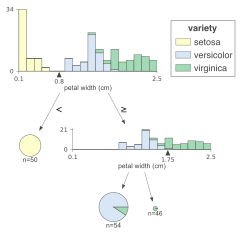
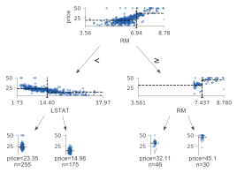
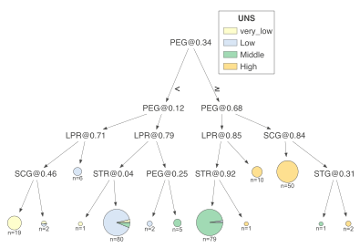
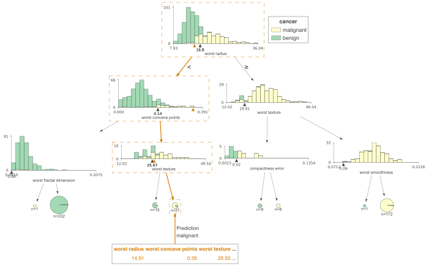
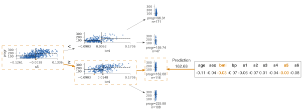
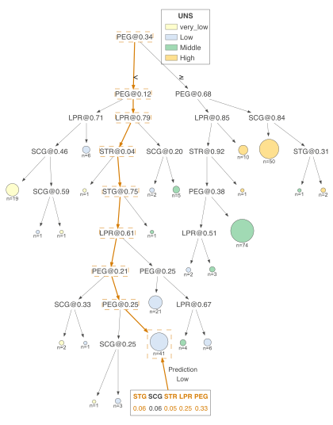
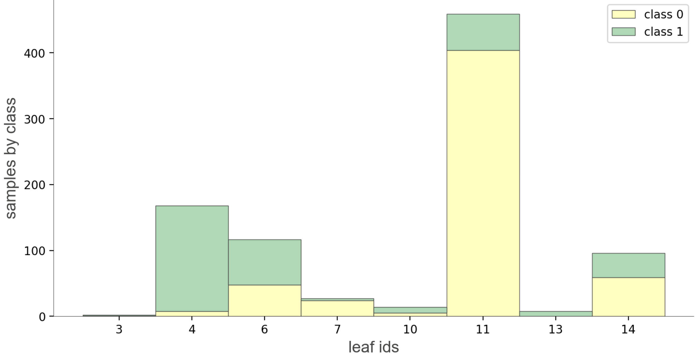
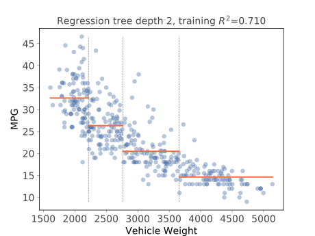
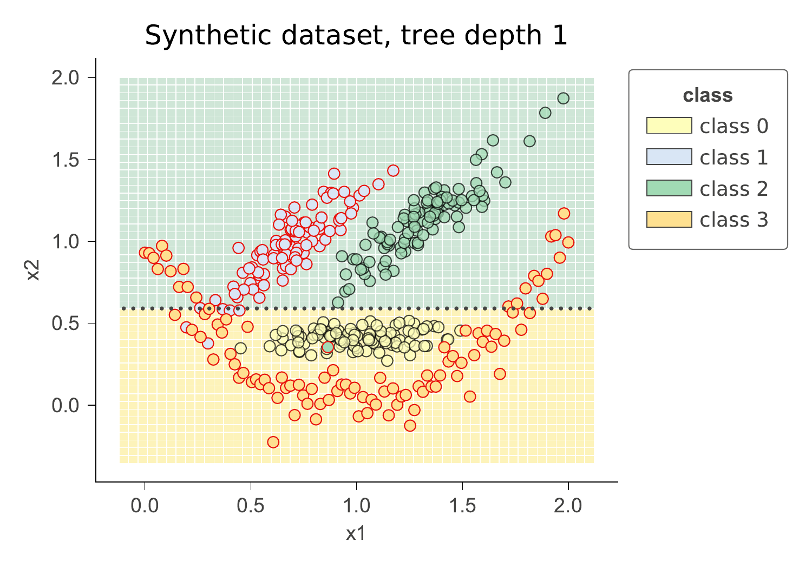
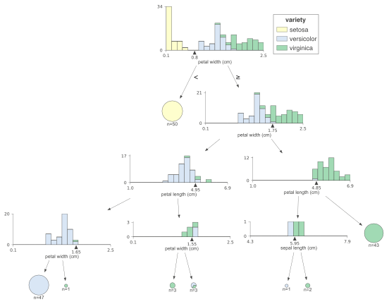

# dtreeviz : Decision Tree Visualization

## Description

A python library for decision tree visualization and model interpretation.  Decision trees are the fundamental building block of [gradient boosting machines](http://explained.ai/gradient-boosting/index.html) and [Random Forests](https://en.wikipedia.org/wiki/Random_forest)(tm), probably the two most popular machine learning models for structured data.  Visualizing decision trees is a tremendous aid when learning how these models work and when interpreting models. The visualizations are inspired by an educational animation by [R2D3](http://www.r2d3.us/); [A visual introduction to machine learning](http://www.r2d3.us/visual-intro-to-machine-learning-part-1/). Please see [How to visualize decision trees](http://explained.ai/decision-tree-viz/index.html) for deeper discussion of our decision tree visualization library and the visual design decisions we made.

Currently dtreeviz supports: [scikit-learn](https://scikit-learn.org/stable), [XGBoost](https://xgboost.readthedocs.io/en/latest), [Spark MLlib](https://spark.apache.org/mllib/), [LightGBM](https://lightgbm.readthedocs.io/en/latest/), and [Tensorflow](https://www.tensorflow.org/decision_forests).  See [Installation instructions](README.md#Installation).

### Authors

* [Terence Parr](https://explained.ai/), a tech lead at Google, and until 2022 was a professor of data science / computer science at Univ. of San Francisco, where he was founding director of the [University of San Francisco's MS in data science program](https://www.usfca.edu/arts-sciences/graduate-programs/data-science) in 2012.
* [Tudor Lapusan](https://www.linkedin.com/in/tudor-lapusan-5902593b/)
* [Prince Grover](https://www.linkedin.com/in/groverpr)

With major code and visualization clean up contributions done by [Matthew Epland](https://www.linkedin.com/in/matthew-epland) (@mepland).

## Sample Visualizations

### Tree visualizations

<table cellpadding="0" cellspacing="0">
<tr>
<td></td>
<td></td>
<td></td>
</tr>
</table>

### Prediction path explanations

<table cellpadding="0" cellspacing="0">
<tr>
<td></td>
<td></td>
<td></td>
</tr>
</table>

### Leaf information

<table cellpadding="0" cellspacing="0">
<tr>
<td></td>
<td></td>
</tr>
</table>

### Feature space exploration

#### Regression

<table cellpadding="0" cellspacing="0">
<tr>
<td></td>
<td></td>
<td></td>
</tr>
</table>

#### Classification

<table cellpadding="0" cellspacing="0">
<tr>
<td></td>
<td></td>
</tr>
</table>

#### Classification boundaries

As a utility function, dtreeviz provides `dtreeviz.decision_boundaries()` that illustrates one and two-dimensional feature space for classifiers, including colors that represent probabilities, decision boundaries, and misclassified entities. This method is not limited to tree models, by the way, and should work with any model that answers method `predict_proba()`. That means any model from scikit-learn should work (but we also made it work with Keras models that define `predict()`). (As it does not work with trees specifically, the function does not use adaptors obtained from `dtreeviz.model()`.) See [classifier-decision-boundaries.ipynb](https://github.com/parrt/dtreeviz/tree/master/notebooks/classifier-decision-boundaries.ipynb).

<table cellpadding="0" cellspacing="0">
<tr>
<td><br></td>
<td></td>
</tr>
</table>

Sometimes it's helpful to see animations that change some of the hyper parameters. If you look in notebook [classifier-boundary-animations.ipynb](https://github.com/parrt/dtreeviz/tree/master/notebooks/classifier-boundary-animations.ipynb), you will see code that generates animations such as the following (animated png files):

<table cellpadding="0" cellspacing="0">
<tr>
<td></td>
<td></td>
</tr>
</table>

## Quick start

See [Installation instructions](README.md#Installation) then take a look at the specific [notebooks](https://github.com/parrt/dtreeviz/tree/master/notebooks) for the supported ML library you're using:

* [sklearn-based examples](notebooks/dtreeviz_sklearn_visualisations.ipynb) ([colab](https://colab.research.google.com/github/parrt/dtreeviz/blob/master/notebooks/dtreeviz_sklearn_visualisations.ipynb))
* [LightGBM-based examples](notebooks/dtreeviz_lightgbm_visualisations.ipynb) ([colab](https://colab.research.google.com/github/parrt/dtreeviz/blob/master/notebooks/dtreeviz_lightgbm_visualisations.ipynb))
* [Spark-based examples](notebooks/dtreeviz_spark_visualisations.ipynb) ([colab](https://colab.research.google.com/github/parrt/dtreeviz/blob/master/notebooks/dtreeviz_spark_visualisations.ipynb))
* [TensorFlow-based examples](notebooks/dtreeviz_tensorflow_visualisations.ipynb) ([colab](https://colab.research.google.com/github/parrt/dtreeviz/blob/master/notebooks/dtreeviz_tensorflow_visualisations.ipynb)) Also see blog at tensorflow.org [Visualizing TensorFlow Decision Forest Trees with dtreeviz](https://www.tensorflow.org/decision_forests/tutorials/dtreeviz_colab)
* [XGBoost-based examples](notebooks/dtreeviz_xgboost_visualisations.ipynb) ([colab](https://colab.research.google.com/github/parrt/dtreeviz/blob/master/notebooks/dtreeviz_xgboost_visualisations.ipynb))
* [Classifier decision boundaries for any scikit-learn model.ipynb](https://github.com/parrt/dtreeviz/tree/master/notebooks/classifier-decision-boundaries.ipynb) ([colab](https://colab.research.google.com/github/parrt/dtreeviz/blob/master/notebooks/classifier-decision-boundaries.ipynb))
* [Changing colors notebook](notebooks/colors.ipynb) ([colab](https://colab.research.google.com/github/parrt/dtreeviz/blob/master/notebooks/colors.ipynb))

To interopt with these different libraries, dtreeviz uses an adaptor object, obtained from function `dtreeviz.model()`, to extract model information necessary for visualization. Given such an adaptor object, all of the dtreeviz functionality is available to you using the same programmer interface. The basic dtreeviz usage recipe is:

1. Import dtreeviz and your decision tree library
2. Acquire and load data into memory
3. Train a classifier or regressor model using your decision tree library
4. Obtain a dtreeviz adaptor model using<br>`viz_model = dtreeviz.model(your_trained_model,...)`
5. Call dtreeviz functions, such as<br>`viz_model.view()` or `viz_model.explain_prediction_path(sample_x)`

**Example**

Here's a complete example Python file that displays the following tree in a popup window:



```python
from sklearn.datasets import load_iris
from sklearn.tree import DecisionTreeClassifier

import dtreeviz

iris = load_iris()
X = iris.data
y = iris.target

clf = DecisionTreeClassifier(max_depth=4)
clf.fit(X, y)

viz_model = dtreeviz.model(clf,
                           X_train=X, y_train=y,
                           feature_names=iris.feature_names,
                           target_name='iris',
                           class_names=iris.target_names)

v = viz_model.view()     # render as SVG into internal object 
v.show()                 # pop up window
v.save("/tmp/iris.svg")  # optionally save as svg
```

In a notebook, you can render inline without calling `show()`. Just call `view()`:

```python
viz_model.view()       # in notebook, displays inline
```


## Installation

Install anaconda3 on your system, if not already done.

You might verify that you do not have conda-installed graphviz-related packages installed because dtreeviz needs the pip versions; you can remove them from conda space by doing:

```bash
conda uninstall python-graphviz
conda uninstall graphviz
```

To install (Python >=3.6 only), do this (from Anaconda Prompt on Windows!):

```bash
pip install dtreeviz             # install dtreeviz for sklearn
pip install dtreeviz[xgboost]    # install XGBoost related dependency
pip install dtreeviz[pyspark]    # install pyspark related dependency
pip install dtreeviz[lightgbm]   # install LightGBM related dependency
pip install dtreeviz[tensorflow_decision_forests]   # install tensorflow_decision_forests related dependency
pip install dtreeviz[all]        # install all related dependencies
```

This should also pull in the `graphviz` Python library (>=0.9), which we are using for platform specific stuff.

**Limitations.** Only svg files can be generated at this time, which reduces dependencies and dramatically simplifies install process.

Please email [Terence](mailto:parrt@antlr.org) with any helpful notes on making dtreeviz work (better) on other platforms. Thanks! 

For your specific platform, please see the following subsections.

### Mac

Make sure to have the latest XCode installed and command-line tools installed. You can run `xcode-select --install` from the command-line to install those if XCode is already installed. You also have to sign the XCode license agreement, which you can do with `sudo xcodebuild -license` from command-line. The brew install shown next needs to build graphviz, so you need XCode set up properly.

You need the graphviz binary for `dot`. Make sure you have latest version (verified on 10.13, 10.14):

```bash
brew reinstall graphviz
```

Just to be sure, remove `dot` from any anaconda installation, for example:

```bash
rm ~/anaconda3/bin/dot
```

From command line, this command

```bash
dot -Tsvg
```

should work, in the sense that it just stares at you without giving an error. You can hit control-C to escape back to the shell.  Make sure that you are using the right `dot` as installed by brew:

```bash
$ which dot
/usr/local/bin/dot
$ ls -l $(which dot)
lrwxr-xr-x  1 parrt  wheel  33 May 26 11:04 /usr/local/bin/dot@ -> ../Cellar/graphviz/2.40.1/bin/dot
$
```

**Limitations.** Jupyter notebook has a bug where they do not show .svg files correctly, but Juypter Lab has no problem.

### Linux (Ubuntu 18.04)

To get the `dot` binary do:
 
```bash
sudo apt install graphviz
```

**Limitations.** The `view()` method works to pop up a new window and images appear inline for jupyter notebook but not jupyter lab (It gets an error parsing the SVG XML.)  The notebook images also have a font substitution from the Arial we use and so some text overlaps. Only .svg files can be generated on this platform.

### Windows 10

(Make sure to `pip install graphviz`, which is common to all platforms, and make sure to do this from Anaconda Prompt on Windows!)

[Download graphviz-2.38.msi](https://graphviz.gitlab.io/_pages/Download/Download_windows.html) and update your `Path` environment variable.  Add `C:\Program Files (x86)\Graphviz2.38\bin` to User path and `C:\Program Files (x86)\Graphviz2.38\bin\dot.exe` to System Path. It's windows so you might need a reboot after updating that environment variable.  You should see this from the Anaconda Prompt:

```
(base) C:\Users\Terence Parr>where dot
C:\Program Files (x86)\Graphviz2.38\bin\dot.exe
```

(Do not use `conda install -c conda-forge python-graphviz` as you get an old version of `graphviz` python library.)

Verify from the Anaconda Prompt that this works (capital `-V` not lowercase `-v`):

```
dot -V
```

If it doesn't work, you have a `Path` problem. I found the following test programs useful. The first one sees if Python can find `dot`:

```python
import os
import subprocess
proc = subprocess.Popen(['dot','-V'])
print( os.getenv('Path') )
```

The following version does the same thing except uses `graphviz` Python libraries backend support utilities, which is what we use in dtreeviz:

```python
import graphviz.backend as be
cmd = ["dot", "-V"]
stdout, stderr = be.run(cmd, capture_output=True, check=True, quiet=False)
print( stderr )
```

If you are having issues with run command you can try copying the following files from: https://github.com/xflr6/graphviz/tree/master/graphviz.

Place them in the AppData\Local\Continuum\anaconda3\Lib\site-packages\graphviz folder.  

Clean out the __pycache__ directory too.

For graphviz windows install 8.0.5 and python interface v0.18+ :  
```python
import graphviz.backend as be
cmd = ["dot", "-V"]
stdout = be.execute.run_check(cmd, capture_output=True, check=True, quiet=False)
print( stdout )
```

Jupyter Lab and Jupyter notebook both show the inline .svg images well.

### Verify graphviz installation

Try making text file `t.dot` with content `digraph T { A -> B }` (paste that into a text editor, for example) and then running this from the command line:

```
dot -Tsvg -o t.svg t.dot
```

That should give a simple `t.svg` file that opens properly.  If you get errors from `dot`, it will not work from the dtreeviz python code.  If it can't find `dot` then you didn't update your `PATH` environment variable or there is some other install issue with `graphviz`.

### Limitations

Finally, don't use IE to view .svg files. Use Edge as they look much better. I suspect that IE is displaying them as a rasterized not vector images. Only .svg files can be generated on this platform.

## Install dtreeviz locally

Make sure to follow the install guidelines above.

To push the `dtreeviz` library to your local egg cache (force updates) during development, do this (from anaconda prompt on Windows):
 
```bash 
python setup.py install -f
```

E.g., on Terence's box, it add `/Users/parrt/anaconda3/lib/python3.6/site-packages/dtreeviz-2.2.2-py3.6.egg`.

## Feedback

We welcome info from users on how they use dtreeviz, what features they'd like, etc... via [email (to parrt)](mailto:parrt@antlr.org) or via an [issue](https://github.com/parrt/dtreeviz/issues).

## Useful Resources

* [How to visualize decision trees](http://explained.ai/decision-tree-viz/index.html)
* [How to explain gradient boosting](http://explained.ai/gradient-boosting/index.html)
* [The Mechanics of Machine Learning](https://mlbook.explained.ai/)
* [Animation by R2D3](http://www.r2d3.us/)
* [A visual introductionn to machine learning](http://www.r2d3.us/visual-intro-to-machine-learning-part-1/)
* [fast.ai's Introduction to Machine Learning for Coders MOOC](https://course18.fast.ai/ml.html)
* Stef van den Elzen's [Interactive Construction, Analysis and
Visualization of Decision Trees](http://alexandria.tue.nl/extra1/afstversl/wsk-i/elzen2011.pdf)
* Some similar feature-space visualizations in [Towards an effective cooperation of the user and the computer for classification, SIGKDD 2000](https://github.com/EE2dev/publications/blob/master/cooperativeClassification.pdf)
* [Beautiful Decisions: Inside BigML’s Decision Trees](https://blog.bigml.com/2012/01/23/beautiful-decisions-inside-bigmls-decision-trees/)
* "SunBurst" approach to tree visualization: [An evaluation of space-filling information visualizations
for depicting hierarchical structures](https://www.cc.gatech.edu/~john.stasko/papers/ijhcs00.pdf)

## License

This project is licensed under the terms of the MIT license, see [LICENSE](LICENSE).

